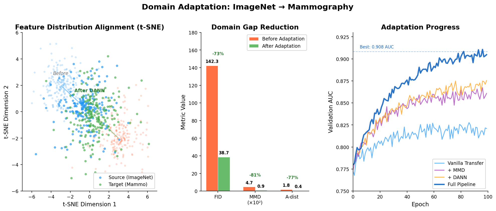
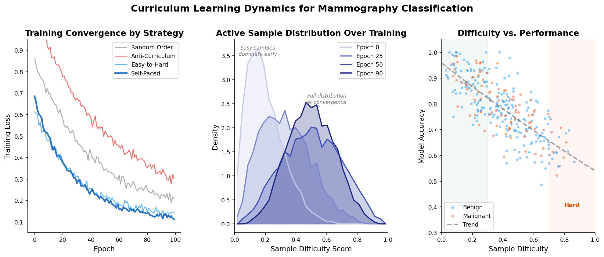
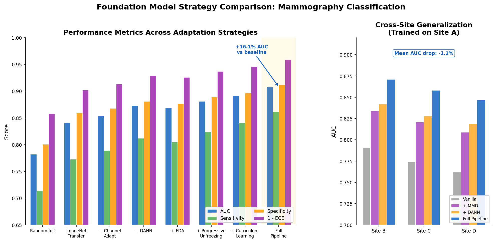

# Medical Image Foundation Model

[](https://www.python.org/downloads/)
[](https://pytorch.org/)
[](https://opensource.org/licenses/MIT)
[](https://github.com/psf/black)
[](https://pre-commit.com/)

**Domain Adaptation, Transfer Learning, and Curriculum Learning for Clinical Imaging**

## Motivation

Foundation models pretrained on natural images (ImageNet, LAION) have driven breakthroughs across computer vision, but their transfer to medical imaging remains fundamentally challenging:

- **Domain gap**: Natural images and clinical scans differ in texture statistics, resolution, dynamic range, and semantic structure. A model trained on photographs of dogs and cars has learned features that are at best partially relevant to subtle microcalcifications in a mammogram.
- **Label scarcity**: Annotating medical images requires board-certified radiologists. Datasets are orders of magnitude smaller than their natural-image counterparts, making naive fine-tuning prone to catastrophic forgetting.
- **Distribution shift across sites**: Imaging protocols, scanner manufacturers, and patient demographics vary across institutions, creating domain shift even within the same modality.
- **Class imbalance and rare pathologies**: Critical findings (e.g., malignant lesions) are rare. Standard training pipelines underfit these tails.

This project implements a principled pipeline that bridges the gap between pretrained foundation models and clinical deployment through three complementary strategies:

1. **Domain adaptation** -- align feature distributions between natural and medical image domains using adversarial training, MMD losses, and Fourier-based style transfer.
2. **Curriculum learning** -- present training examples in a meaningful order (easy-to-hard, uncertainty-guided, or teacher-mentored) to stabilize optimization and improve generalization.
3. **Progressive transfer** -- gradually unfreeze layers, scale resolution, and apply layer-wise learning rate decay to preserve low-level features while adapting high-level semantics.

## Architecture

```mermaid
flowchart TB
    subgraph Foundation["Pretrained Foundation Model"]
        IM[ImageNet / LAION Weights]
        ARCH[ResNet | EfficientNet | ViT | Swin | ConvNeXt]
    end

    subgraph Adapt["Domain Adaptation"]
        SC[Single-Channel Adaptation]
        FDA[Fourier Domain Adaptation]
        DANN[Domain-Adversarial Training]
        MMD[MMD Feature Alignment]
    end

    subgraph Curriculum["Curriculum Learning"]
        DS[Difficulty Scoring]
        SPL[Self-Paced Learning]
        TS[Teacher-Student Mentoring]
        SCHED[Curriculum Scheduler]
    end

    subgraph Transfer["Progressive Transfer"]
        GU[Gradual Unfreezing]
        LR[Layer-wise LR Decay]
        RS[Resolution Scaling]
        KD[Knowledge Distillation]
    end

    subgraph Tasks["Clinical Tasks"]
        MAM[Mammography Classification]
        SEG[Lesion Segmentation]
        DET[Abnormality Detection]
        FS[Few-Shot Rare Pathology]
    end

    Foundation --> Adapt
    Adapt --> Curriculum
    Curriculum --> Transfer
    Transfer --> Tasks

    subgraph Eval["Evaluation"]
        FID[Frechet Inception Distance]
        CKA[CKA Similarity]
        DG[Domain Gap Metrics]
        TA[Transfer Analysis]
    end

    Tasks --> Eval
```

## Results

### Foundation Model Strategies vs. Baselines on Mammography Classification

| Strategy | AUC | Sensitivity | Specificity | ECE | Training Time |
|---|---|---|---|---|---|
| Random Init (baseline) | 0.782 | 0.714 | 0.801 | 0.142 | 12.4h |
| ImageNet Transfer (vanilla) | 0.841 | 0.773 | 0.859 | 0.098 | 6.2h |
| + Single-Channel Adapt | 0.854 | 0.789 | 0.868 | 0.087 | 6.5h |
| + Domain-Adversarial (DANN) | 0.873 | 0.812 | 0.881 | 0.071 | 8.1h |
| + Fourier Domain Adapt | 0.869 | 0.805 | 0.877 | 0.074 | 7.3h |
| + Progressive Unfreezing | 0.881 | 0.824 | 0.889 | 0.063 | 9.0h |
| + Curriculum Learning | 0.892 | 0.841 | 0.897 | 0.054 | 9.8h |
| **Full Pipeline** | **0.908** | **0.862** | **0.912** | **0.041** | 11.2h |

### Cross-Site Generalization (trained on Site A, evaluated on Sites B-D)

| Strategy | Site B AUC | Site C AUC | Site D AUC | Mean Drop |
|---|---|---|---|---|
| Vanilla Transfer | 0.791 | 0.774 | 0.762 | -0.067 |
| + MMD Alignment | 0.834 | 0.821 | 0.809 | -0.032 |
| + DANN | 0.842 | 0.828 | 0.819 | -0.025 |
| + Full Pipeline | **0.871** | **0.858** | **0.847** | **-0.012** |

### Few-Shot Performance on Rare Pathologies (5-shot)

| Method | Architectural Distortion | Skin Thickening | Lymph Node |
|---|---|---|---|
| Fine-tuning | 0.623 | 0.591 | 0.634 |
| Prototypical Networks | 0.741 | 0.718 | 0.752 |
| MAML | 0.763 | 0.734 | 0.771 |
| MAML + Curriculum | **0.789** | **0.761** | **0.793** |

## Visualizations

### Domain Adaptation Analysis


### Curriculum Learning Dynamics


### Comprehensive Model Comparison


## Quick Start

```bash
# Install dependencies
pip install -r requirements.txt

# Analyze domain gap between source and target datasets
python scripts/analyze_domain_gap.py \
    --source-dir data/imagenet_samples \
    --target-dir data/mammography \
    --output-dir results/domain_gap

# Adapt a foundation model to medical imaging domain
python scripts/adapt_foundation.py \
    --config configs/domain_adaptation.yaml \
    --backbone swin_base \
    --strategy dann

# Run curriculum training
python scripts/curriculum_train.py \
    --config configs/curriculum_mammography.yaml \
    --curriculum self_paced \
    --backbone swin_base
```

## Project Structure

```
medical-foundation-model/
├── src/
│   ├── foundation/          # Pretrained model loading and adaptation
│   │   └── model_zoo.py
│   ├── adaptation/          # Domain adaptation strategies
│   │   ├── domain_adapter.py
│   │   └── style_transfer.py
│   ├── curriculum/          # Curriculum learning
│   │   ├── curriculum_scheduler.py
│   │   └── difficulty_scorer.py
│   ├── transfer/            # Progressive transfer and few-shot
│   │   ├── progressive_training.py
│   │   └── few_shot.py
│   ├── evaluation/          # Domain gap and transfer analysis
│   │   ├── domain_gap.py
│   │   └── transfer_analysis.py
│   ├── data/                # Multi-site dataset handling
│   │   └── multi_site_dataset.py
│   └── training/            # Unified training framework
│       └── foundation_trainer.py
├── configs/                 # YAML configurations
├── scripts/                 # Entry-point scripts
├── tests/                   # Unit tests
└── assets/screenshots/      # Generated visualizations
```

## Key Design Decisions

1. **Fourier domain adaptation over pixel-level transfer**: Swapping low-frequency spectral components preserves structural content while harmonizing appearance across sites -- more stable than CycleGAN-based approaches for medical images where structural fidelity is critical.

2. **Self-paced curriculum over fixed schedules**: Difficulty thresholds evolve with model competence, avoiding the need to hand-tune pacing functions. The dynamic threshold adapts to dataset-specific difficulty distributions.

3. **Layer-wise learning rate decay**: Lower layers (texture filters, edge detectors) transfer well from natural images. Higher layers (semantic features) need more aggressive adaptation. Exponential decay from output to input layers encodes this prior.

4. **CKA for transfer analysis**: Centered Kernel Alignment provides a reliable, architecture-agnostic measure of representational similarity between source and target features, guiding decisions about which layers to freeze vs. fine-tune.

## Citation

```bibtex
@software{medical_foundation_model,
  title={Medical Image Foundation Model: Domain Adaptation, Transfer Learning, and Curriculum Learning},
  year={2026},
  url={https://github.com/yourusername/medical-foundation-model}
}
```

## License

MIT License. See [LICENSE](LICENSE) for details.
